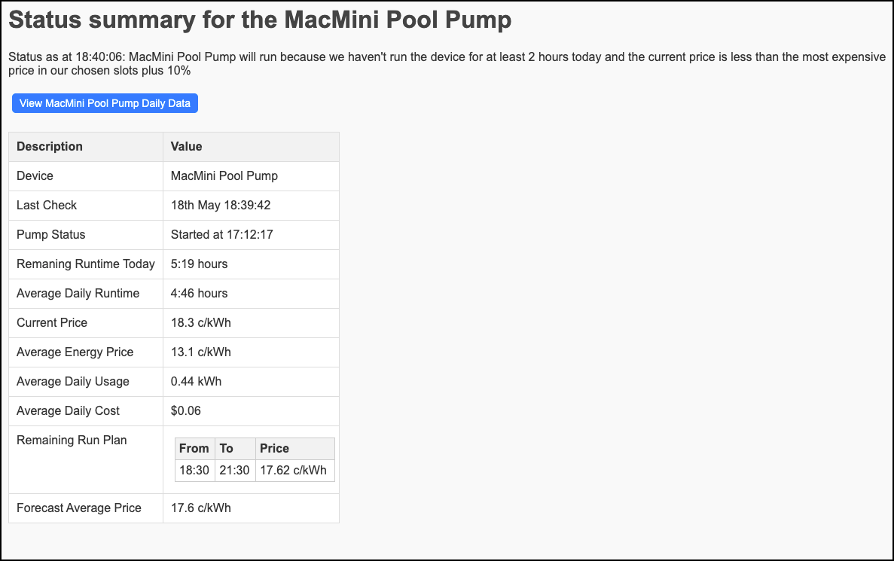

# AmberPowerController Web Interface
The simple Python web app is used to display current status and recent history from one or more AmberPowerController installations. Before using this app, please instal and run at least one instance of the AmberPowerController app, available here

https://github.com/NickElseySpelloC/AmberPowerController 

# Basic Installation and Configuration
1. Ensure that the basic prerequities are installed:

* Python 3.x installed:
macOS: `brew install python3`
Windows: `inget install python3 --source winget --scope machine`
* UV for Python installed:
macOS: `brew install uvicorn`
Windows: `pip install uv`

The shell script used to run the web app (*launch.sh*) is uses the *uv sync* command to ensure that all the prerequitie Python packages are installed in the virtual environment.

2. Copy the PowerControllerUI folder and including sub-directories to a new folder, for example */home/pi/scripts/PowerControllerUI*
3. Rename the _config.yaml.example_ file to _config.yaml_ file and at review the following settings:

## Configuration File 

```
Website:
    HostingIP: 0.0.0.0
    Port: 8000
    PageAutoRefresh: 15
    DebugMode: True
    AccessKey: <Optional access key>

Files:
    LogfileName: logfile.log
    LogProcessID: True
    LogfileMaxLines: 200
    # How much information do we write to the log file. One of: none; error; warning; summary; detailed; debug; all
    LogfileVerbosity: detailed
    # How much information do we write to the console. One of: error; warning; summary; detailed; debug; all
    ConsoleVerbosity: detailed
```
### Config Section: Website

| Parameter | Description | 
|:--|:--|
| HostingIP: | The IP address that the web server is listening on. Set to 127.0.0.1 by default. Use this if you will be setting up a production environment. | 
| Port: | The port to listen on, defaults to 8000.| 
| PageAutoRefresh: | Delay in seconds before the summary pages automatically refresh. Defaults to 10 seconds. Set to blank or 0 to disable refresh. | 
| DebugMode: | False by default. If True, an exceptions will be reported via the web brower. Set to True for testing, False for a production deployment. | 
| AccessKey: | An optional alphanumeric key that is used to protect access to the web site. If specified, the key must be included in the website URL, for example: http://127.0.0.1:8000/home?key=abcdef123456. If you specify a key, the same key must also be set for the _WebsiteAccessKey_ parameter in the AmberPowerController application's configuration file.  | 

#### Config Section: Files

| Parameter | Description | 
|:--|:--|
| LogfileName | A text log file that records progress messages and warnings. | 
| LogProcessID | If True, include the process ID in the log entries. | 
| LogfileMaxLines| Maximum number of lines to keep in the MonitoringLogFileMaxLines. If zero, file will never be truncated. | 
| LogfileVerbosity | The level of detail captured in the log file. One of: none; error; warning; summary; detailed; debug; all | 
| ConsoleVerbosity | Controls the amount of information written to the console. One of: error; warning; summary; detailed; debug; all. Errors are written to stderr all other messages are written to stdout | 

# Running the web app
For the remaining steps below, we assume that:
* Your RaspberryPi is using IP _192.168.1.20_
* You have configured your web app to bind to port _8000_
* You haven't setup an AccessKey

Use the shell script to run the web app. This uses UV to create the virtual environment and install the necessary Python packages:
`./launch.sh`

Go to http://192.168.1.20:8000/home to view the web page. You should see something like this:


Now go edit the _PowerControllerConfig.yaml_ config file for the AmberPowerController app. In the _DeviceType_ section, enter the details of this web app:
```
  WebsiteBaseURL: http://192.168.1.20:8000
  WebsiteAccessKey: <Optional access key>
```

Now go back to your web brower and refresh the web app page. You should see something like this


Run the PowerController app (or wait until it auto-runs from crontab). When it runs, it should post the latest state data to this web site. 

# Running automatically from SystemDaemon
Follow these steps to run a single thread of the web app in a non-production instance. Skip this and go to **Setup a Production Environment** if deploying to production.

This uses the /home/pi/scripts/PowerControllerUI/PowerControllerUI.sh script to launch the web app.

## 1. Create a systemd service file
Create a new system service file:
`sudo nano /etc/systemd/system/PowerControllerUI.service`

Paste the following into the editor:
```
[Unit]
Description=PowerController Web Interface
After=network.target

[Service]
ExecStart=/home/pi/scripts/PowerControllerUI/PowerControllerUI.sh 
WorkingDirectory=/home/pi/scripts/PowerControllerUI
StandardOutput=inherit
StandardError=inherit
Restart=always
RestartSec=10
User=pi

[Install]
WantedBy=multi-user.target
```

Note: Restart=always ensures the service is restarted automatically if it crashes. RestartSec=10 creates a 10 second delay before the restart.

## 2. Enable the service to run at boot
`sudo systemctl enable PowerControllerUI.service`

Now start the service:
`sudo systemctl start PowerControllerUI.service`

Check the service status or logs:
`sudo systemctl status PowerControllerUI.service`
`journalctl -u PowerControllerUI.service -b`

# Setup a production Environment
This section shows you how to do a production deployment of the PowerControllerUI web app on a RaspberryPi. This assumes that the web UI files have been deployed to _/home/pi/scripts/PowerControllerUI_. You may need to modify these steps for other enviroments (macOS, Windows, etc.). 

## 1. Install Prerequisites
```
sudo apt update
sudo apt install python3-pip python3-venv nginx
```

## 2. Activate the virtual environment and test Gunicorn manually
```
cd /home/pi/scripts/PowerControllerUI
source .venv/bin/activate
gunicorn --bind 127.0.0.1:8000 wsgi:app
```

Visit http://192.168.1.20:8000/home to confirm it works. If you get an Access Denied message, add the Access Key that you specified in the config file, for example:
http://127.0.0.1:8000/home?key=abcdef123456 

Note: Use deactivate to exit from the virtual environment

## 3. Create a systemd service for Gunicorn
`sudo nano /etc/systemd/system/PowerControllerUIProd.service`

And paste the following into the editor:
```
[Unit]
Description=Gunicorn instance to serve the PowerControllerUI app
After=network.target

[Service]
User=pi
Group=www-data
WorkingDirectory=/home/pi/scripts/PowerControllerUI
Environment="PATH=/home/pi/scripts/PowerControllerUI/venv/bin"
ExecStart=/home/pi/scripts/PowerControllerUI/venv/bin/gunicorn --workers 3 --bind 127.0.0.1:8000 wsgi:app

[Install]
WantedBy=multi-user.target
```

Enable and start the service:
```
sudo systemctl daemon-reload
sudo systemctl enable PowerControllerUIProd
sudo systemctl start PowerControllerUIProd
```

Check status:
```
sudo systemctl status PowerControllerUIProd
journalctl -u PowerControllerUIProd.service -b
```

## 4. Configure NGINX as a reverse proxy
`sudo nano /etc/nginx/sites-available/PowerControllerUI`

And paste the following into the editor (replace 192.168.1.20 with the IP of your RaspberryPi):
```
server {
    listen 80;
    server_name 192.168.86.34;

    location / {
        proxy_pass http://127.0.0.1:8000;
        proxy_set_header Host $host;
        proxy_set_header X-Real-IP $remote_addr;
        proxy_set_header X-Forwarded-For $proxy_add_x_forwarded_for;
        proxy_set_header X-Forwarded-Proto $scheme;
    }
}
```
Enable the site:
`sudo ln -s /etc/nginx/sites-available/PowerControllerUI /etc/nginx/sites-enabled`

Test the config:
`sudo nginx -t`

Reload and start the service:
```
sudo systemctl daemon-reload
sudo systemctl reload nginx
```

Check the status:
`systemctl status nginx.service`

## 5. Setup an SSL certificate
Optionally, install an SSL certificate on nginx so that we can access the web app using https://

### Confirm inbound ports unblocked
Confirm that your ISP is not blocking inbound ports 80 and 443 on your public IP. Aussie Broadband blocks by default. It might be necessary to request a static IP from your ISP to get inbound ports unblocked. 

### Test that you can access via port 80
Configure your router to route port 80 externally to port 8000 on your RaspberryPi. Confirm that you can access the web app from a web browser external to your network (e.g. on a mobile connection).

### Setup a domain name or host name
Register a domain name or add a DNS A record to an existing domain that you own for your public IP. The rest of this section assumes that you have a host name of _power.abc.com_ with a DNS A record pointing at your networks public IP.

Go to http://power.abc.com and confirm that you can access the web app from a web browser external to your network.

### Use certbot to get your SSL certificate
Install certbot:
`sudo apt install certbot python3-certbot-nginx`

Run certbot for your nginx reverse proxy:
`sudo certbot –nginx`

You need to have port 80 open to your reverse proxy for this to work. During the certbot process you will be prompted for your domain name, for example _power.abc.com_.

At the end you will see something like this:
> IMPORTANT NOTES:
>  \- Unable to install the certificate
>  \- Congratulations! Your certificate and chain have been saved at:
>    /etc/letsencrypt/live/power.abc.com/fullchain.pem
>    Your key file has been saved at:
>    /etc/letsencrypt/live/power.abc.com/privkey.pem
>    Your certificate will expire on 2025-07-24. To obtain a new or
>    tweaked version of this certificate in the future, simply run
>    certbot again with the "certonly" option. To non-interactively
>    renew *all* of your certificates, run "certbot renew"

### Add the SSL certificate keys to your nginx configuration file
Edit the file:
`sudo nano /etc/nginx/sites-available/PowerControllerUI`

And change the file so that it now looks like this:

```
server {
    listen 80;
    server_name power.abc.com;

    # Redirect all HTTP to HTTPS
    return 301 https://$host$request_uri;
}

server {
    listen 443 ssl;
    server_name power.elseyworld.com;

    ssl_certificate /etc/letsencrypt/live/power.elseyworld.com/fullchain.pem;
    ssl_certificate_key /etc/letsencrypt/live/power.elseyworld.com/privkey.pem;

    location / {
        proxy_pass http://127.0.0.1:8000;
        proxy_set_header Host $host;
        proxy_set_header X-Real-IP $remote_addr;
        proxy_set_header X-Forwarded-For $proxy_add_x_forwarded_for;
        proxy_set_header X-Forwarded-Proto $scheme;
    }
}
```

Save the file and test the configuration:
`sudo nginx -t`

Reload the configuration:
`sudo systemctl reload nginx`

### Test the HTTPS connection
Open up port forwarding on your route for port 443 externally to port 443 internally. Now got to https://power.abc.com from an external web browser and make sure it works. 
