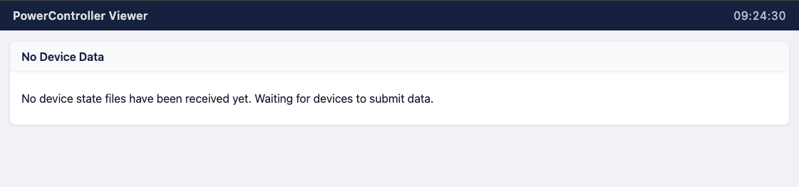
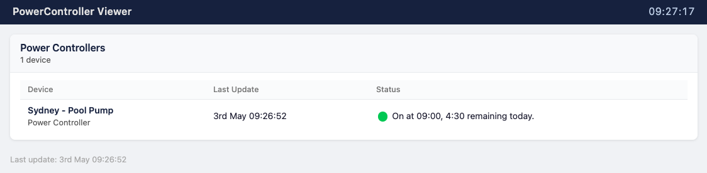

# PowerControllerViewer Web Interface
The simple Python web app is used to display current status and recent history from one or more PowerController, and/or LightingControl installations. Before using this app, please install and run at least one instance of the one of these apps, available here

https://github.com/NickElseySpelloC/

# Basic Installation

## Prerequities

Ensure that the basic prerequities are installed:

1. Python 3.13 installed:
2. UV for Python installed:

## Installing the app 

For this documentation, we'll assume your current user is `pi` and you're installing the app at _/home/pi/scripts/PowerControllerViewer/_

Clone the app from the github repo

```bash
cd /home/pi/scripts/
git clone https://github.com/NickElseySpelloC/PowerControllerViewer.git
```

Now create and edit the config file:

```bash
cd /home/pi/scripts/PowerControllerViewer
cp config.yaml.example config.yaml

nano config.yaml
```

Edit the file as per the guide below and then save.

## Configuration File 

The app expects to find the file config.yaml int he project root folder. The following keys and sections are supported.

```yaml
Website:
  HostingIP: 0.0.0.0
  Port: 8000
  PageAutoRefresh: 30
  AccessKey: 

Files:
  LogfileName: logfile.log
  LogProcessID: True
  LogfileMaxLines: 5000
  LogfileVerbosity: detailed
  ConsoleVerbosity: summary
```
### Config Section: Website

| Parameter | Description | 
|:--|:--|
| HostingIP: | The IP address that the web server is listening on. Set to 0.0.0.0 to listen on all network interfaces on the host. If setting up a production environment (see below), set to 127.0.0.1. | 
| Port: | The port to listen on, defaults to 8000.| 
| PageAutoRefresh: | Delay in seconds before any web page does a full automatically browser refresh (to update non-data elements). Defaults to 10 seconds. Set to blank or 0 to disable refresh. | 
| AccessKey: | An optional alphanumeric key that is used to protect access to the web site. If specified, the key must be included in the website URL, for example: http://127.0.0.1:8000/home?key=abcdef123456. Alternatively, you can set the VIEWER_ACCESS_KEY environment variable in the .env file. <br><br>If you specify a key, the same key must also be set for the _WebsiteAccessKey_ parameter in the sending application's configuration file.  | 

#### Config Section: Files

| Parameter | Description | 
|:--|:--|
| LogfileName | A text log file that records progress messages and warnings. | 
| LogProcessID | If True, include the process ID in the log entries. | 
| LogfileMaxLines| Maximum number of lines to keep in the MonitoringLogFileMaxLines. If zero, file will never be truncated. | 
| LogfileVerbosity | The level of detail captured in the log file. One of: none; error; warning; summary; detailed; debug; all | 
| ConsoleVerbosity | Controls the amount of information written to the console. One of: error; warning; summary; detailed; debug; all. Errors are written to stderr all other messages are written to stdout | 
| DeleteOldStateFiles |  Delete state data files older than this many hours. Set to 0 or blank to disable deletion. | 


# Running the web app

For the remaining steps below, we assume that:
* Your host is using IP _192.168.1.20_
* You have configured your web app to bind to port _8000_
* You haven't setup an AccessKey

Use the shell script to run the web app. This uses UV to create the virtual environment and install the necessary Python packages:
`./launch.sh`

Go to http://192.168.1.20:8000/home to view the web page. You should see something like this:


Now go edit the _config.yaml_ config file for the PowerController or LightingControl app instance. In the section for the viewer website, enter the details of this web app:
```
  WebsiteBaseURL: http://192.168.1.20:8000
  WebsiteAccessKey: <Optional access key>
```

Now go back to your web brower and refresh the web app page. You should see something like this


# Setup a production Environment
This section shows you how to do a production deployment of the PowerControllerViewer web app on a Linux host (inc. a  RaspberryPi). This assumes:

1. The app has been deployed to _/home/pi/scripts/PowerControllerViewer_ and tested as per the instructions above.
2. Your host's IP address is 192.168.1.20 and the app is listening on port 8000 (change if required in the examples below). 

## 1. Install Prerequisites
```bash
sudo apt update
sudo apt install python3-pip python3-venv nginx
```

## 2. Configure the app to accept local connections only

Edit the config.yaml file and set the _HostingIP_ key to 127.0.0.1. This forces the web app to only accept connections from the nginx running locally on the same host (we'll setup nginx in a moment).


## 3. Create a systemd service for the app
```bash
sudo nano /etc/systemd/system/PowerControllerViewer.service
```

And paste the following into the editor:
```
[Unit]
Description=PowerControllerViewer web app
After=network.target

[Service]
ExecStart=/home/pi/scripts/PowerControllerViewer/launch.sh 
WorkingDirectory=/home/pi/scripts/PowerControllerViewer
StandardOutput=journal
StandardError=journal
User=pi
Environment=PYTHONUNBUFFERED=1
Environment=PATH=/home/pi/.local/bin:/usr/local/sbin:/usr/local/bin:/usr/sbin:/usr/bin:/sbin:/bin

# Logging and restart behavior
Restart=on-failure        # Only restart on non-zero exit code
RestartSec=10             # Wait 10 seconds before restarting

# Limit restart attempts (3 times in 60 seconds)
StartLimitIntervalSec=60
StartLimitBurst=3

[Install]
WantedBy=multi-user.target
```

Enable and start the service:
```bash
sudo systemctl daemon-reload
sudo systemctl enable PowerControllerViewer
sudo systemctl start PowerControllerViewer
```

Check status:
```bash
sudo systemctl status PowerControllerViewer
journalctl -u PowerControllerViewer.service -b
```

## 4. Configure NGINX as a reverse proxy

In this setup we setup a nginx reverse proxy server on your Linux host to listen on port 8088 and direct traffic to the PowerControllerViewer app on port 8000. 

> This step assumes that nothing else is using port 8088 on your host. Do `sudo netstat -tulnp | grep :8088` to test.
>
> We have avoided using port 80 as it may be used by some otehr app (PiHole, Apache, etc.).

```bash
sudo nano /etc/nginx/sites-available/PowerControllerViewer
```

And paste the following into the editor (replace 192.168.1.20 with the IP of your host):
```
server {
    listen 8088;
    server_name 192.168.1.20;

    location / {
        proxy_pass http://127.0.0.1:8000;
        proxy_set_header Host $host;
        proxy_set_header X-Real-IP $remote_addr;
        proxy_set_header X-Forwarded-For $proxy_add_x_forwarded_for;
        proxy_set_header X-Forwarded-Proto $scheme;
    }
}
```

Enable the proxy
```bash
sudo rm /etc/nginx/sites-enabled/default
sudo ln -s /etc/nginx/sites-available/PowerControllerViewer /etc/nginx/sites-enabled
```

Test the config:
```bash
sudo nginx -t
```

Reload and start the service:
```bash
sudo systemctl daemon-reload
sudo systemctl reload nginx
```

Check the status:
```bash
systemctl status nginx.service
```
At this point the PowerControllerViewer app should be running and accessible on port 80 to remote clients on your local network: http://192.168.1.20:8088

You could map an external port on your internet router (say port 80) to the host's IP and port 8088 so that you can access the app from the internet, but we recommend that before do that, you setup SSL and a domain name.

# Setup support for https (SSL) and a domain name

In this section we will enhance the production environment, installing an SSL certificate on nginx so that we can access the web app using https://.... The example below, the end state will be:

* Web app accessible from the internet at https://power.abc.com
* Public port 443 (https) is mapped to a nginx reverse proxy on the internal host, listing on port 4430. nginx:4430 routes the https traffic to the web app listing onthe same host as 127.0.0.1:8000
* Public port 80 (http) is mapped to the same nginx reverse proxy on the internal host, listing on port 8088. nginx:8088 routes just certbot requests to certbot for SSL auto-renewals. Everything else is redirected to https

## Determine your public IP address

1. Determine the public IP of the network hosting your server, using https://whatismyipaddress.com/. 
2. Ideally you should have a static IP assigned to your WAN interface (contact your ISP) or failing that have setup a Dynamic DNS service.

## Confirm inbound ports unblocked

Map port 80 on your WAN interface to port 8088 internally to the internal host (192.168.1.20 in our example).
Map port 443 on your WAN interface to port 4430 internally to the same internal host.

Confirm that your ISP is not blocking inbound port 80 on your public IP. Aussie Broadband blocks by default. It might be necessary to request a static IP from your ISP to get inbound ports unblocked. 

## Register a domain name or sub-domain name

We want to be able to access the app via a a domain name (e.g. https://abc.com) or sub-domain name (e.g. https://power.abc.com). 

Register a new domain or select a subdomain name to use on an existing domain that you own. Configure the domain's DNS records with your public IP address. For the documentation below, we will assume you are using the subdomain mypower.somedomainname.com which has an A record IP address matching your WAN public IP.


## Use certbot to get your SSL certificate

Install certbot:
```bash
sudo apt install certbot python3-certbot-nginx
```

Run certbot for your nginx reverse proxy:
```bash
sudo certbot --nginx
```

You need to have port 80 open to your reverse proxy for this to work (see above). During the certbot process you will be prompted for your domain name, for example _power.abc.com_.

At the end you will see something like this:
```bash
> IMPORTANT NOTES:
>  - Unable to install the certificate
>  - Congratulations! Your certificate and chain have been saved at:
>    /etc/letsencrypt/live/power.abc.com/fullchain.pem
>    Your key file has been saved at:
>    /etc/letsencrypt/live/power.abc.com/privkey.pem
>    Your certificate will expire on 2025-07-24. To obtain a new or
>    tweaked version of this certificate in the future, simply run
>    certbot again with the "certonly" option. To non-interactively
>    renew *all* of your certificates, run "certbot renew"
```

## Add the SSL certificate keys to your nginx configuration file
Edit the file:
```bash
sudo nano /etc/nginx/sites-available/PowerControllerViewer
```

And change the file so that it now looks like this:

```
# Listen for http traffic on port 8088, which is mapped from port 80 on the WAN interface
# We only accept http traffic for certbot auto-renewals
server {
    listen 8088;
    server_name power.abc.com;

    # Everything else redirects to HTTPS
    location / {
        # If external clients actually connect on 443, leave it as:
        # return 301 https://$host$request_uri;

        # If they connect on 4430 externally, include the port:
        # return 301 https://$host:4430$request_uri;

        return 301 https://$host$request_uri;
    }
}

# Listen for https traffic on port 4430, which is mapped from port 443 on the WAN interface
# This will route traffic to the PowerControllerViewer app if it have a valid certificate
server {
    listen 4430 ssl;
    server_name power.abc.com;
    ssl_certificate /etc/letsencrypt/live/power.abc.com/fullchain.pem; # managed by Certbot
    ssl_certificate_key /etc/letsencrypt/live/power.abc.com/privkey.pem; # managed by Certbot

    # Send the https traffic to the web app listening locally on port 8000
    location / {
        proxy_pass http://127.0.0.1:8000;
        proxy_set_header Host $host;
        proxy_set_header X-Real-IP $remote_addr;
        proxy_set_header X-Forwarded-For $proxy_add_x_forwarded_for;
        proxy_set_header X-Forwarded-Proto $scheme;
    }

}
```

Save the file and test the configuration:
```bash
sudo nginx -t
sudo systemctl reload nginx
```

## Manual renewal
If you're having problems with the certbot auto-renewing your SSL certificate:

First, make sure the directory exists:

```bash
sudo mkdir -p /var/www/certbot/.well-known/acme-challenge
sudo chown -R www-data:www-data /var/www/certbot
```

Test nginx serving from it:
```bash
echo test | sudo tee /var/www/certbot/.well-known/acme-challenge/test-file
```

Then from outside your network, or using mobile data:

```bash
curl http://power.abc.com/.well-known/acme-challenge/test-file
```

You should get:

```bash
test
```

If that works, request/renew with:

```bash
sudo certbot certonly --webroot -w /var/www/certbot -d power.abc.com
```
Then test renewal:

```bash
sudo certbot renew --dry-run
```

## Test the HTTPS connection

Go to https://power.abc.com from an external web browser and make sure it works. 
